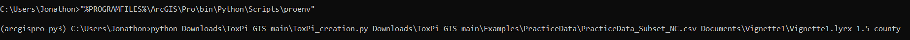
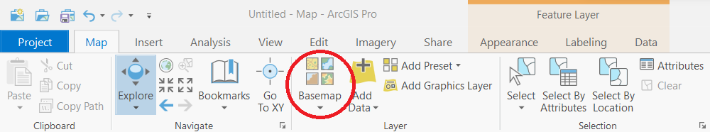
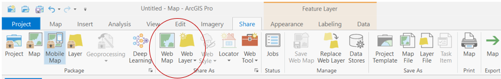

# **Vignette 1: Generating a ToxPi feature layer of COVID-19 vulnerability using ToxPi_creation.py**  
Vignette 1 is a demonstration of method 1 in the map creation workflow using [Toxpi_creation.py](../ToxPi_creation.py) and Covid-19 vulnerability data. The resulting map can be found [here](https://ncsu.maps.arcgis.com/home/item.html?id=7c0365b3f75949369b46c07ae4ecf10c). The practice data used in this demonstration was already processed through steps 1A and 1B and can be found [here](./PracticeData/). It is suggested to use the subset as it will significantly reduce running time(Full ~ 30min, Subset ~ 5min). A further description of the data can be found [here](https://www.niehs.nih.gov/research/programs/coronavirus/covid19pvi/details/).  

<p align = "center">
  
</p>  

## Requirements:  
* ArcGIS Pro licensing  
* Requires being logged into ArcGIS Portal  
* Source column for data must be formatted Latitude, Longitude(See [Utilities](../Utilities/) for help if needed)    
* Column labeled Name with unique identifiers must be present in data  
* Slice names must not contain a special character followed by a number  
* Windows Operating System  
* Lyrx file must be output to a separate location folder for new maps, else it will overwrite the previous map layers within the geodatabase  
* Slice names must be formatted from the output of the ToxPi GUI for proper symbology  
* Column names other than the [ToxPi Score, HClust Group, KMeans Group, Name, Longitude, Latitude, FIPS, Tract, casrn] should not be included unless they are slices  

## Steps:  
1A, 1B. Already done, download entire repository, results data are [here](../Examples/PracticeData/) in repository     
1C. Run [ToxPi_creation.py](../ToxPi_creation.py) from windows command prompt using the following commands and parameters
```
"%PROGRAMFILES%\ArcGIS\Pro\bin\Python\Scripts\proenv" (Used to load ArcGIS Pro environment)  
python location\ToxPi_creation.py inputfile outputfile.lyrx --scale=1 --extent="" --labels=False (Used to run script, replace location with path to file)  

Parameters:
* inputfile - The ToxPi GUI results file to draw ToxPi profiles from  
* outputfile.lyrx - The location for the result lyrx file output by the script. Please add .lyrx  
* scale - Optionally scales the size of the ToxPi profiles. The default is 1  
* extent - Optionally provides an administrative boundary layer. Options are:  
    * censusTract
    * county
    * state
    * division
    * region
* labels - Optionally set to True to add labels to the profiles based on the Name column. 
```

* Example:  
<p align = "center">
  
</p>  

1D. Open .lyrx file in ArcGIS Pro, add Basemap if desired  
<p align = "center">
  
</p>  
1E. Share as a web map to ArcGIS Online  
<p align = "center">
  
</p>  

## Output:  
  * Script makes a geodatabase in the location folder called ToxPiAuto.gdb containing necessary information for the layer file as well as intermediate feature layers 
  * Script outputs a layer file at outputfile.lyrx  
  * Sharing provides a web URL for the public to view your map  

## Map Details:  
Interactive slices with custom popups  
Colored slices based on ToxPi GUI choices  
Toggleable maximum score rings  
Sizing based on script parameters  
Boundary layer based on data extent  
Profile labels based on sample names  

## General Troubleshooting:  
* Error when accessing environment  
  * Make sure quotes are included  
  * The location to the proenv may be different if you did a custom installation location of ArcGIS Pro 
* Error when running script  
  * If a file not found error is given, try using the full file path for outputfile.lyrx instead of the current directory  
  * If location is your current directory, use .\ to reference the location   
  * Make sure .lyrx is present on outfile   
  * Make sure you are logged into ArcGIS Portal and have required ArcGIS Pro licensing  
  * Make sure nonessential columns are not present in data  
  * Make sure name column is present  
* Mapping Incorrect  
  * Ensure source is formatted latitude, longitude. [swap_coordinates.py](../Utilities/Swap_Coordinates.py) is provided in Utilities folder if coordinates need to be swapped  
  * Each time script is run to generate a map a different directory should be used unless overwriting a previous map   
