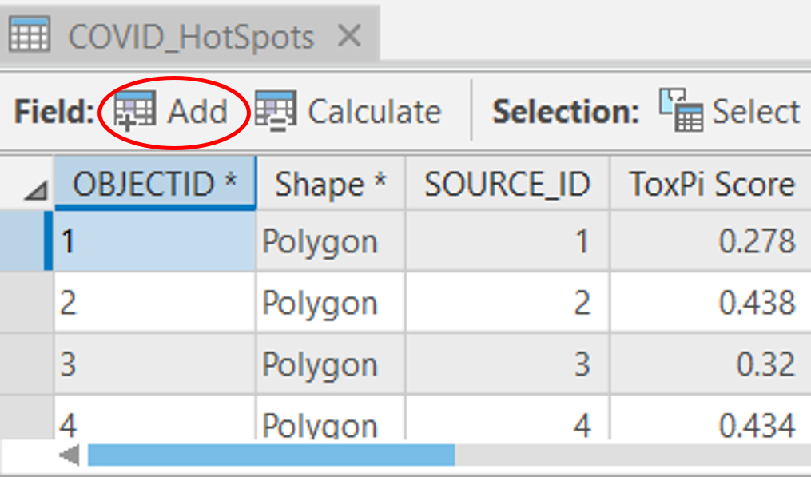

# **Vignette 4: Hot Spot Analysis Demonstration and Dashboard Creation Using COVID-19 Data**  
Vignette 4 is a demonstration of one of the many analysis methods that can be done via integrating the ToxPi\*GIS Toolkit with existing ArcGIS methods. It uses hot spot analysis on the results of Vignette 3 with the full dataset to display high and low risk clusters for COVID-19 throughout the United States. The results are displayed in a Dashboard to demonstrate the hosting and extended visualization capablities that ArcGIS provides. The resulting dashboard can be found [here](https://ncsu.maps.arcgis.com/home/item.html?id=022416cbc74d430691ad7d2a4cbec229). A further description of the data can be found [here](https://www.niehs.nih.gov/research/programs/coronavirus/covid19pvi/details/).  

  
  

  

## Hotspot Analysis Steps:  
1. Generate ToxPi and choropleth feature layers using ToxPi_creation_customized.py and the full dataset(See Vignette 3 for help)  
2. Open layer file in ArcGIS Pro  
3. Delete excess layers (state and mid layers)  
4. Run Optimized Hot Spot Analysis Tool on local boundary layer with a distance band of 50 miles    

  

  

5. Use Join Field Tool to join the Hotspot result layer with the local boundary layer using SourceID and FID to obtain any desired fields  

  

  

6. Add raw data containing cases and deaths to the project  
7. Open hotspot layer attribute table and add field named FIPSLong of data type long    

  

  

8. Calculate FIPSLong field by setting it equal it to the FIPS column(This step allows for joining to raw data since it reads in as type Long)  

  

  

  

  

10. Use Join Field Tool to join the Hotspot result layer with the raw data using FIPSLong and casrn to obtain any desired fields  

  

  

11. Delete FIPSLong column(Right-click in the attribute table and select delete)  
12. Edit symbology of hotspot layer to black for no significance(Double click the feature in the Table of Contents, Properties, and then change color)   
13. Reorder ToxPi layer and ring layer to be above hotspot layer(Drag within table of contents)  
14. Configure Hotspot layer popups(Right-click layer, configure popups, edit fields, deselect fields of no interest and reorder fields)   
15. Share to ArcGIS Online  

## Dashboard Creation Steps:  
1. Go to shared description page for map on ArcGIS Online under "Content"  
2. Select dashboard under "Create Web App"  

  

  

4. Fill out dashboard information and select "Create Dashboard"  
5. Add elements to the dashboard using the plus in the header and selecting the desired element  

  

  
 
* Add and customize indicator elements for data display upon feature selection for a desired layer, the demonstration has 7 indicator panels on the left for HotSpot layer  
  * Customizing an indicator:
    * In the data tab, select Feature and the desired field to show under "Value Field", and set "Maximum Features Displayed" to 1.   
    

      
    
 
    
    * In the indicator tab, populate text positions with desired info. To denote a field value, use {} or select from the "Fields" pull down. The value option references the "Value Field" selected earlier  
    

      
    
 
    
    * Play with other options within both these tabs; indicators provide significant customizability, filtering, analysis, and provision of reference data for comparison  

* Add and customize a list element for selecting features (counties)  
  * Customizing a list: 
    * In the Data tab, set the maximum number of features displayed and how to sort the list (a smaller list size leads to faster loading)  
    

      
    
 
    
    * In the List tab, set the line item template to {Name} and turn Line item icon off, this is what determines how features are displayed in the list  
    

      
    
 
    
    * In the Actions tab, select add action and add both a filter and a zoom. For filter, add the seven indicators as targets(filters indicators on list selection). For zoom add the HotSpot map as a target(zooms the map to the selected feature)  
    

      
    
 
    
* Add and customize a rich text element to describe the dashboard and fill in with necessary info  
* Add a legend element to the dashboard 
* Configure map to filter list based on map extent  
  * Hover top left of the map, select the gear, go to Map Actions, and choose the list as target of the filter action  
  * Check out other map customizability options in separate tabs  
* Relocate panels as desired
  * To move a panel, hover the top left of it and hold the drag item icon while moving the panel to the desired location  
  * To resize a panel, hover over the edge of a panel and drag it to the desired size  
* Save the dashboard  
