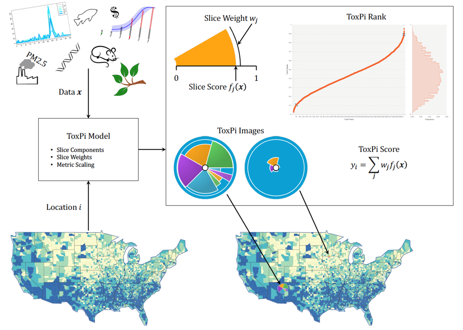
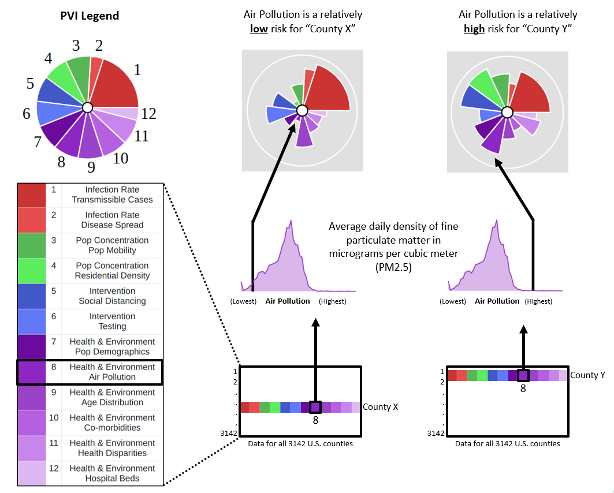
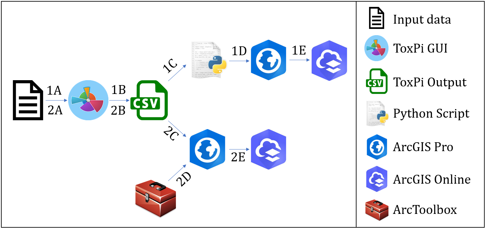

# ToxPi\*GIS Toolkit
## **GitHub Directory:** 
The following methods are used for the production and visualization of shareable, interactive feature layers containing ToxPi figures using ArcGIS Pro. To learn more about ToxPi, see [ToxPi Description](#ToxPi-Description) below.  

* For users looking to generate a predesigned layer file of ToxPi features with Python, or users who are unsure, see [Method 1](#method-1-toxpi_creationpy--toxpi_creation_customizedpy).  

* For users looking to use an ArcGIS Toolbox(e.g., for integration into existing ArcGIS workflows), see [Method 2](#method-2-toxpitoolboxtbx).  

* For users looking to see example walkthroughs, see the vignettes in [Examples](./Examples/).  

* For users looking to visualize existing maps, see [Visualizations](./Examples/Visualizations.md).  

* For users requiring help with data manipulation and formatting requirements, see [Utilities](./Utilities/).  

## **ToxPi Description:** 

**Definition**  
The ToxPi framework provides a method for transparently integrating and visualizing data across disparate information domains and is often used to determine risk values for the data being analyzed.  
 

**Description**  
Data that are not normally compared are combined into a data matrix comprising various data domains, or slice categories, with varying weights that represent the different data categories. Each slice category, represented by a color scheme, can then be separated into subdomains. The data matrix is then analyzed to produce a risk score ranging from 0 to 1 for each slice category, as well as a corresponding overall score that represents the record’s total risk from all categories. These scores are determined via a rank system for easy comparison between different data points and are displayed in a ToxPi diagram for each record. If the data record's are locations, the figures can be mapped geographically. The calculation process, as well as ToxPi figure interpretation for Covid-19 data, are depicted below. For a more in depth look at the ToxPi framework, visit www.toxpi.org

Calculation  
 
  

  

Interpretation
 
  

  

## **Map Creation Workflow:**  

  

  
  

  
## **Method 1: ToxPi_creation.py & ToxPi_creation_customized.py**   
Use the script [ToxPi_creation.py](ToxPi_creation.py)  to automatically produce predesigned feature layers containing interactive ToxPi features using the output of the ToxPi GUI as input. This is the suggested method, unless you are skilled with ArcGIS Pro and have a specific need for a Toolbox. An example walkthrough is shown in [Vignette 1](./Examples/Vignette1-%20Using%20ToxPi_creation.md). 
  
[ToxPi_creation_customized.py](ToxPi_creation_customized.py) can be used with county or census tract data for a more data rich map and acts as an example of how ToxPi_creation.py can be customized with further geoprocessing steps to create more advanced maps for specific data. An example walkthrough is shown in [Vignette 3](/Examples/Vignette3-%20Using%20ToxPi_creation_customized.md).  

Steps:  
1A. Load raw data into the [ToxPi GUI](https://toxpi.org/)  
1B. Analyze data and output results file to a CSV, and make sure file meets data requirements    
1C. Run python script from windows command prompt using the required parameters  
1D. Open output layer file in ArcGIS Pro  
1E. Share resulting map to ArcGIS Online  

## **Method 2: ToxPiToolbox.tbx**  
The ToxPiToolbox.tbx file is an ArcToolbox that contains a custom tool called ToxPi Construction for drawing the polygons that make up ToxPi figures. It requires more manual steps than the script; however, a model can be created for the automation of map creation, and the toolbox allows for more customization than the script, including drawing a subset of slices for ToxPi features. This, along with a walkthrough example, are described under [Vignette 2](/Examples/Vignette2-%20Using%20ToxPiToolbox.md).  

Steps:  
2A. Load raw data into the [ToxPi GUI](https://toxpi.org/)  
2B. Analyze data and output results file to a CSV, and split the coordinates into two separate columns  
2C. Add results file to ArcGIS Pro  
2D. Add ToxPiToolbox.tbx to ArcGIS Pro  
2E. Run required analysis steps including the ToxPi tool and share resulting map to ArcGIS Online   

## **Acknowledgements/References:**  
We thank the PVI project team for data provision, the Motsinger-Reif Lab at NIH for consulting and software testing, and the Baker Lab at NCSU for software testing. This work was supported by intramural funds from the National Institute of Environmental Health Sciences and the National Institute for Allergy and Infectious Diseases. Portions of the code for drawing slices were adapted from the Coxcomb tool for ArcGIS Pro. 

    
    
